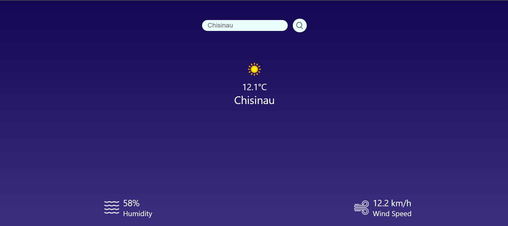

# Weather React

## A Simple Weather App Built with React and External API Integration

**Weather React** is a lightweight application developed using **React** that fetches real-time weather data from a third-party API.

Upon loading, the application displays a **"Loading"** message. Once a user enters a city name, the current weather information for that city is retrieved and displayed.

---

## 🌦️ Weather Display Page

